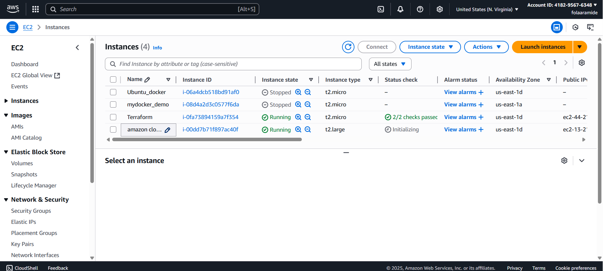
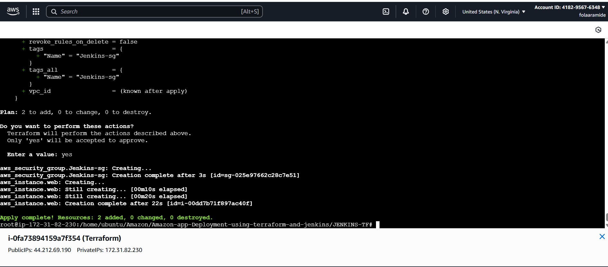
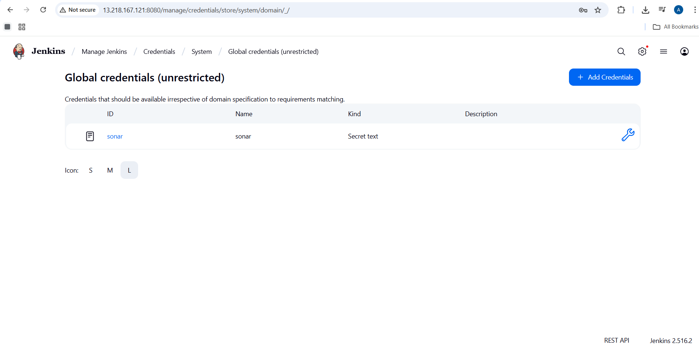
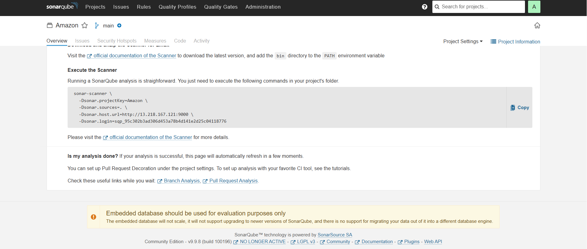
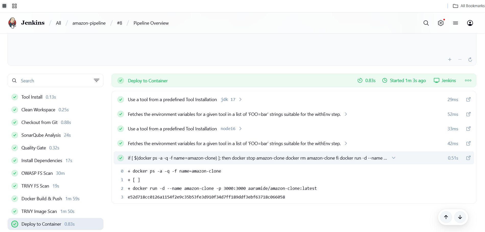
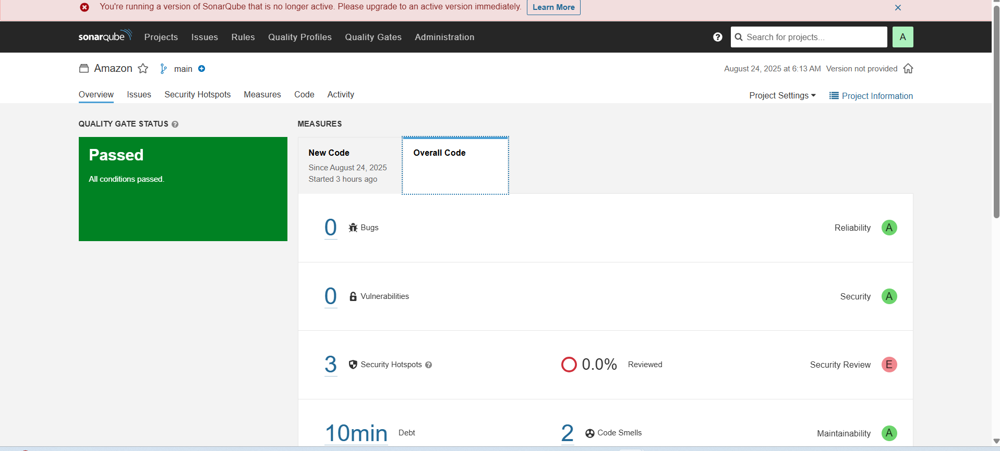
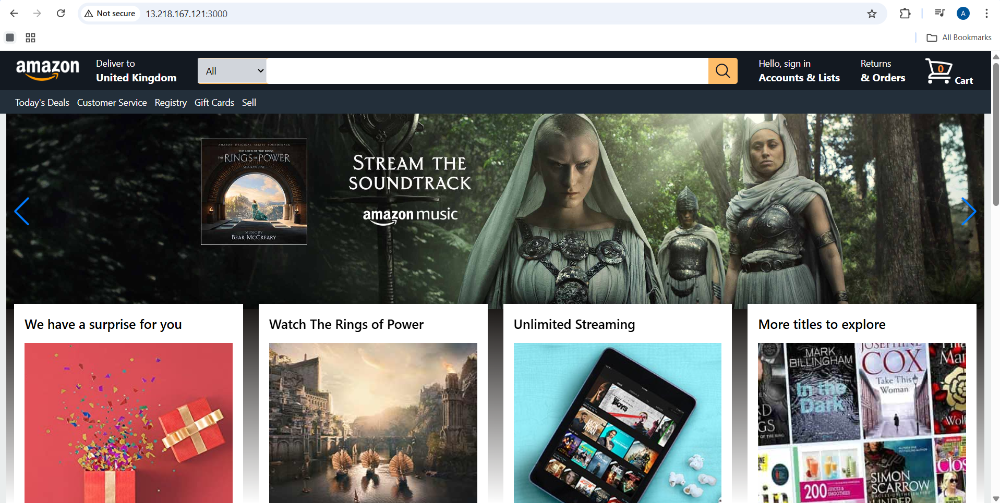

# Project: Deploy & Manage Amazon-like Shopping Website using DevOps Tools (Terraform, Jenkins CI/CD, SonarQube, Docker & Trivy on AWS Cloud).

## Scenario: ShopifyLite, a startup building an Amazon-clone shopping platform, asked me to set up a fully automated infrastructure and deployment pipeline.

Developers built the application (React + Node.js) and handed me the code.

I (DevOps Engineer) provisioned the infrastructure using Terraform and created a Jenkins pipeline for CI/CD with automated security and quality scans.

## Step 1: Launched & Configured AWS EC2 Instance

Created an EC2 instance (Ubuntu 22.04, t2.micro) for DevOps setup.

Configured key pair & security group (allowed HTTP, HTTPS, SSH).

Verified instance running (2/2 status checks).

**Commands:**

sudo su

apt update -y

## Step 2: Installed Terraform & AWS CLI

Installed Terraform to manage infra as code, and AWS CLI to interact with AWS programmatically.

# Installed Terraform
sudo apt install wget -y

wget -O- https://apt.releases.hashicorp.com/gpg | sudo gpg --dearmor -o /usr/share/keyrings/hashicorp-archive-keyring.gpg

echo "deb [signed-by=/usr/share/keyrings/hashicorp-archive-keyring.gpg] https://apt.releases.hashicorp.com $(lsb_release -cs) main" | sudo tee /etc/apt/sources.list.d/hashicorp.list

sudo apt update && sudo apt install terraform -y

# Installed AWS CLI
sudo apt -y install unzip curl

curl "https://awscli.amazonaws.com/awscli-exe-linux-x86_64.zip" -o "awscliv2.zip"

unzip awscliv2.zip

sudo ./aws/install

aws --version

## Step 3: Configured IAM User & AWS Credentials

Created IAM user in AWS with AdministratorAccess.

Downloaded credentials .csv.

### Configured AWS CLI:

aws configure

Enter Access Key, Secret Key, region (e.g. us-east-1)

## Step 4: Project Setup & Cloning Application Code

Created workspace directory ShopifyLite.

Cloned developers’ source code from GitHub  [app/](./app).

Set up separate folders:

/terraform → Infra as Code

/jenkins → Pipeline

/app → Application source

## Step 5: Built Infrastructure with Terraform
Inside, [terraform/](./terraform), I created [main.tf](./terraform/main.tf), and[provider.tf](./terraform/provider.tf)

Initialized & Applied Terraform
1. terraform init
2. terraform plan
3. terraform apply --auto-approve

### Output: EC2 instance running with Jenkins, Docker, SonarQube, Trivy pre-installed.

## Step 6: Set Up Jenkins

Accessed Jenkins at: http://<EC2-PUBLIC-IP>:8080.

Retrieved initial admin password:

sudo cat /var/lib/jenkins/secrets/initialAdminPassword

**Installed required plugins:**
1. SonarQube Scanner
2. Docker Pipeline
3. NodeJS
4. OWASP Dependency Check
5. Prometheus

## Step 7: Configured Jenkins CI/CD Pipeline  
  - [Pipeline](./jenkins/Pipeline) 
## Step 8: Configured SonarQube & DockerHub

Created SonarQube token and added to Jenkins credentials.

Added DockerHub credentials to Jenkins.

Configured SonarQube server under Jenkins global settings.

## Step 9: Results & Proof

Terraform deployed infra

Jenkins pipeline automated build & deploy

SonarQube reports generated

Trivy scanned Docker image 

App live at http://<13.218.167.121>:3000 

## Conclusion

This project demonstrated end-to-end DevOps automation for ShopifyLite:

IaC with Terraform (AWS infra)

CI/CD with Jenkins (automated build, scan, deploy)

Code Quality & Security (SonarQube, Trivy, OWASP)

Dockerized Deployment on AWS EC2

The result: ShopifyLite now has a production-ready pipeline with faster releases, higher code quality, and secure deployments.
